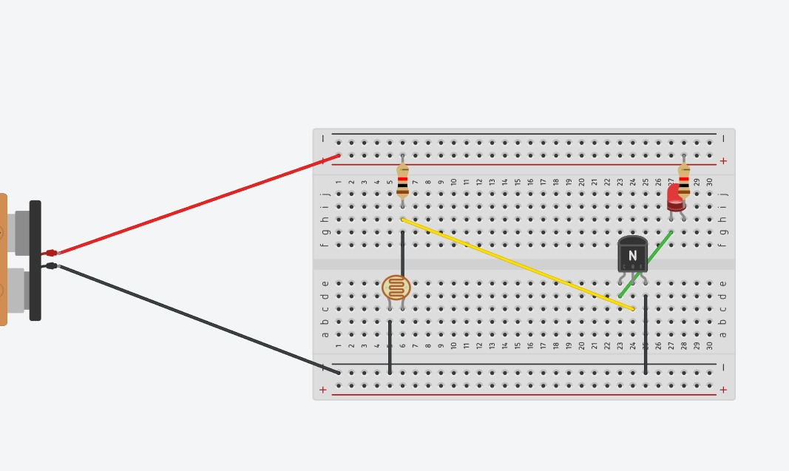

# **ENGINEERING PROJECT DOCUMENT**

# LIGHT DEPENDENT RESISTOR (LDR) AUTOMATIC LIGHT CIRCUIT

          **LDR-Based Light Sensing and Automatic LED Control**

**1\. Aim**  
To design and demonstrate an LDR-based automatic lighting circuit in which the brightness of an LED is controlled according to the surrounding light level. The circuit demonstrates the practical use of a light sensor, transistor switching, a current-limiting resistor, and a battery-powered supply.

**2\. Objective**  
	Understand the operating principle of a Light Dependent Resistor (LDR).  
	Detect changes in ambient light using the change in LDR resistance.  
	Use a transistor as an electronic switch to control an LED.  
	Build and test the circuit on a breadboard using a battery supply.  
	Understand a simple automatic lighting application used in engineering.

**3\. Components Required**

Component	Typical Value / Type	Purpose  
LDR	Light Dependent Resistor	Senses surrounding light  
LED	Red LED	Indicates the output/light condition  
Transistor	NPN transistor	Acts as an electronic switch  
Resistor	Current-limiting / bias resistor	Limits current and sets circuit conditions  
Battery	9 V battery	Provides DC power to the circuit  
Breadboard	Solderless	Allows temporary circuit assembly  
Jumper wires	Male-to-male	Provides electrical connections

**4\. Description**

An LDR (Light Dependent Resistor), also called a photoresistor, is a passive electronic component whose resistance changes with the intensity of incident light. Its resistance is generally high in darkness and decreases when more light falls on its surface. This property allows an LDR to be used as a simple light sensor.  
In the demonstrated circuit, the LDR is combined with a transistor and resistors to form a light-sensitive switching circuit. The transistor responds to the voltage produced by the sensor network and controls the current through the LED.

**5\. Working Principle**  
	When the surrounding light level changes, the resistance of the LDR changes.  
	This resistance change alters the voltage at the transistor's control terminal (base in an NPN transistor circuit).  
	When the transistor receives sufficient base voltage/current, it conducts and allows current to flow through the LED circuit.  
	The LED therefore changes its ON/OFF state according to the light condition and the exact circuit arrangement.  
	By adjusting the resistor values or adding a potentiometer, the switching threshold can be changed.

**6\. Circuit Operation**

The battery supplies DC voltage to the breadboard power rails. The LDR and resistor network acts as a voltage-sensitive sensor. The transistor amplifies the small control signal from this sensor and works as a switch. The LED is connected in the transistor's output path with a suitable resistor to limit LED current.  
**7\. Circuit Diagram and Practical Prototype**  

